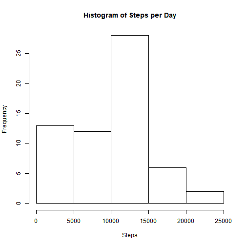

```r
title: "Reproducible Research: Peer Assessment 1.  By Mark Smith."
```

```
## Warning: NAs introduced by coercion
```

```
## Error in title:"Reproducible Research: Peer Assessment 1.  By Mark Smith.": NA/NaN argument
```

```r
output: html_document
```

```
## Error in eval(expr, envir, enclos): object 'output' not found
```

```r
keep_md: true
```

```
## Error in eval(expr, envir, enclos): object 'keep_md' not found
```

# Introduction
I have included most of the text from both the questions on the "Instructions" and "My Submission" page as they differ slightly.  The R code is embedded with all anaysis as required.  Please note that knitr is embedding images into the HTML so no image/figure folder is required.

# Loading and preprocessing the data
* Load the data (i.e. read.csv())
* Process/transform the data (if necessary) into a format suitable for your analysis

Please ensure that "activity.csv" is available for loading in the working directory of the script.

```r
library(data.table)
library(dplyr)
library(lubridate)
library(ggplot2)

activity <- tbl_df(fread("activity.csv")) %>% 
        mutate(date = ymd(date))
```

# What is mean total number of steps taken per day?
* Calculate the total number of steps taken per day
* Histogram of the total number of steps taken each day

```r
stepsPerDay <- unlist(activity %>% 
        group_by(date) %>% 
        summarise(stepsInDay = sum(steps, na.rm = TRUE)) %>% 
        select(stepsInDay)
        )
print(stepsPerDay)
```

```
##  stepsInDay1  stepsInDay2  stepsInDay3  stepsInDay4  stepsInDay5 
##            0          126        11352        12116        13294 
##  stepsInDay6  stepsInDay7  stepsInDay8  stepsInDay9 stepsInDay10 
##        15420        11015            0        12811         9900 
## stepsInDay11 stepsInDay12 stepsInDay13 stepsInDay14 stepsInDay15 
##        10304        17382        12426        15098        10139 
## stepsInDay16 stepsInDay17 stepsInDay18 stepsInDay19 stepsInDay20 
##        15084        13452        10056        11829        10395 
## stepsInDay21 stepsInDay22 stepsInDay23 stepsInDay24 stepsInDay25 
##         8821        13460         8918         8355         2492 
## stepsInDay26 stepsInDay27 stepsInDay28 stepsInDay29 stepsInDay30 
##         6778        10119        11458         5018         9819 
## stepsInDay31 stepsInDay32 stepsInDay33 stepsInDay34 stepsInDay35 
##        15414            0        10600        10571            0 
## stepsInDay36 stepsInDay37 stepsInDay38 stepsInDay39 stepsInDay40 
##        10439         8334        12883         3219            0 
## stepsInDay41 stepsInDay42 stepsInDay43 stepsInDay44 stepsInDay45 
##            0        12608        10765         7336            0 
## stepsInDay46 stepsInDay47 stepsInDay48 stepsInDay49 stepsInDay50 
##           41         5441        14339        15110         8841 
## stepsInDay51 stepsInDay52 stepsInDay53 stepsInDay54 stepsInDay55 
##         4472        12787        20427        21194        14478 
## stepsInDay56 stepsInDay57 stepsInDay58 stepsInDay59 stepsInDay60 
##        11834        11162        13646        10183         7047 
## stepsInDay61 
##            0
```

```r
hist(stepsPerDay, main = "Histogram of Steps per Day", xlab = "Steps")
```



* Mean and median number of steps taken each day

```r
stepSummary <- activity %>% 
        group_by(date) %>% 
        summarise(stepsInDay = sum(steps, na.rm = TRUE)) %>%
        mutate(mean = mean(stepsInDay), median = median(stepsInDay))

summaryUnimputed <- summarise(stepSummary, mean = mean(stepsInDay), median = median(stepsInDay))
print("Unimputed mean and median:")
```

```
## [1] "Unimputed mean and median:"
```

```r
print(summaryUnimputed)
```

```
## # A tibble: 1 x 2
##    mean median
##   <dbl>  <int>
## 1 9354.  10395
```

# What is the average daily activity pattern?
* Time series plot (i.e. type = "l") of the 5-minute interval (x-axis) and the average number of steps taken, averaged across all days (y-axis)
* Note that I have used ggplot instead of the base plotting system, so there is no 'type = "l"'.

```r
intervalSummary <- activity %>% 
        group_by(interval) %>% 
        summarise(average = mean(steps, na.rm = TRUE))

ggplot(intervalSummary, aes(interval, average)) + 
        geom_line() +
        ggtitle(label = expression("Average number of steps taken per interval, averaged across all days")) + 
        scale_y_continuous(name = "Steps") +
        scale_x_continuous(name = "Interval") 
```


* The 5-minute interval that, on average, contains the maximum number of steps
* Using the intervalSummary data from the last step we can find the interval(s) which equal the maximum out of the set.

```r
filter(intervalSummary, average == max(average))
```

```
## # A tibble: 1 x 2
##   interval average
##      <int>   <dbl>
## 1      835    206.
```


# Imputing missing values
Note that there are a number of days/intervals where there are missing values (coded as NA). The presence of missing days may introduce bias into some calculations or summaries of the data.

* Calculate and report the total number of missing values in the dataset (i.e. the total number of rows with NAs)

The value 'TRUE' represents the number of NAs in the steps column/vector.  I have kept the TRUE and FALSE values for easy comparison with the next step.

```r
summary(is.na(activity$steps))
```

```
##    Mode   FALSE    TRUE 
## logical   15264    2304
```

* Devise a strategy for filling in all of the missing values in the dataset. The strategy does not need to be sophisticated. For example, you could use the mean/median for that day, or the mean for that 5-minute interval, etc.  Create a new dataset that is equal to the original dataset but with the missing data filled in.
* Code to describe and show a strategy for imputing missing data

I took the following approach for this after considering what would give the reasonable accuracy:

1. Find the per-interval mean with NA values removed to give an indicative value likely for that interval.

2. Join the original data to the interval means

3. Use the SQL-style coalesce function to take the first non-NA value so any interval that has a value will get its orignal value, but if it has no value it will inherit the value from the interval mean column.

4. Save the tidy result into imputedActivity for later use.

5. Confirm that there are no NAs left in the imputed data (only a 'FALSE' count should be returned.)

It is worth noting that the imputation could be significantly enhanced by changing the granularity from average-day-interval to be more specific i.e. by weekends or by the actual day of the week.  This may be good or bad depending on the available data i.e. if most Sundays had data missing then imputing their data from a small sample of good Sundays could give skewed results.


```r
intervalSummary <- activity %>% 
        group_by(interval) %>% 
        summarise(average = as.integer(round(mean(steps, na.rm = TRUE),0)))
intermediateActivity <- left_join(activity, intervalSummary)
```

```
## Joining, by = "interval"
```

```r
imputedActivity <- intermediateActivity %>% 
        mutate(steps = coalesce(steps, average)) %>%
        select(date,interval,steps)
summary(is.na(imputedActivity$steps))
```

```
##    Mode   FALSE 
## logical   17568
```

## Histogram of the total number of steps taken each day after missing values are imputed
* Make a histogram of the total number of steps taken each day and Calculate and report the mean and median total number of steps taken per day. Do these values differ from the estimates from the first part of the assignment? 
* What is the impact of imputing missing data on the estimates of the total daily number of steps?


```r
ImputedStepsPerDay <- imputedActivity %>% 
        group_by(date) %>% 
        summarise(stepsInDay = sum(steps))
hist(ImputedStepsPerDay$stepsInDay, 
     main = "Histogram of Steps Per Day with Imputed values", 
     xlab = "Steps")
```


```r
summaryImputed <- summarise(ImputedStepsPerDay, mean = mean(stepsInDay), median = median(stepsInDay))
print("Unimputed mean and median:")
```

```
## [1] "Unimputed mean and median:"
```

```r
print(summaryUnimputed)
```

```
## # A tibble: 1 x 2
##    mean median
##   <dbl>  <int>
## 1 9354.  10395
```

```r
print("Imputed mean and median:")
```

```
## [1] "Imputed mean and median:"
```

```r
print(summaryImputed)
```

```
## # A tibble: 1 x 2
##     mean median
##    <dbl>  <int>
## 1 10766.  10762
```

```r
change <- round((summaryImputed-summaryUnimputed)/summaryUnimputed*100, 1)
names(change) <- c("MeanPercentChange", "MedianPercentChange")
print(change)
```

```
##   MeanPercentChange MedianPercentChange
## 1              15.1                 3.5
```
## Analysis
We can see from the results that the median increases slightly (3.5%), but the mean increases significantly (15.1%) suggesting that the missing data significantly decreases the mean in the unimputed set.


#Are there differences in activity patterns between weekdays and weekends?
* For this part the weekdays() function may be of some help here. Use the dataset with the filled-in missing values for this part.
* Create a new factor variable in the dataset with two levels – “weekday” and “weekend” indicating whether a given date is a weekday or weekend day.
* Make a panel plot containing a time series plot (i.e. type = "l") of the 5-minute interval (x-axis) and the average number of steps taken, averaged across all weekday days or weekend days (y-axis). See the README file in the GitHub repository to see an example of what this plot should look like using simulated data.

Please note I have used ggplot so there is no 'type = "l"'.

* Panel plot comparing the average number of steps taken per 5-minute interval across weekdays and weekends

```r
intervalTypeSummary <- imputedActivity %>% 
        mutate(dayOfWeek = weekdays(date)) %>%
        mutate(dayType = case_when(dayOfWeek %in% c("Saturday", "Sunday") ~ "Weekend", TRUE ~ "Weekday")) %>%
        group_by(interval, dayType) %>% 
        summarise(average = as.integer(mean(steps, na.rm = TRUE)))

ggplot(intervalTypeSummary, aes(interval, average)) + 
        facet_grid(dayType ~ .) +
        geom_line() +
        ggtitle(label = expression("Steps for each Type of Day")) + 
        scale_y_continuous(name = "Steps") +
        scale_x_continuous(name = "Interval")
```


## Analysis
We can see there are some differences between the weekday and weekend activity:

1. Weekdays see higher activity between 0500-1000 and 1730-1900 than weekends, possibly related to travel to/from  work/study, and only moving short distances within these areas during the day.

2. Weekends see higher activity between 1000-1730 which is different to weekdays, although there is still a split morning peak but no major evening peak.  Overall, there are sustained levels of activity from morning until mid-afternoon, suggesting more varied activity on weekends.  
```

